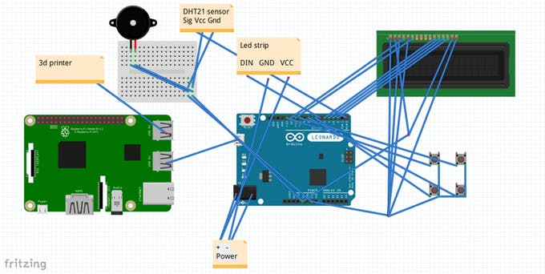

# Octoprint printing monitor

Arduino + python project that shows some information about printing progress on LCD screen and gives you some abilities to control your printer!

[Project on instructables](https://www.instructables.com/id/Octoprint-Printing-Monitor/)

[Project on Arduino project hub](https://create.arduino.cc/projecthub/ralex2304/octoprint-printing-monitor-791c93)

[Project on Thingiverse](https://www.thingiverse.com/thing:3528330)
